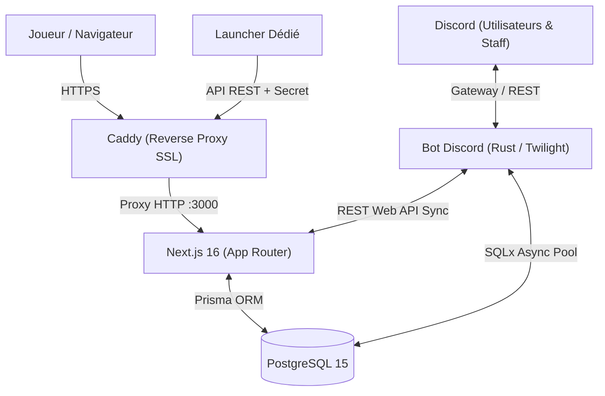

# Architecture Globale — Paranoia Studio

Ce document décrit l'architecture technique, les flux de données et l'organisation modulaire de l'écosystème **Paranoia Studio**.

---

## 1. Vue d'ensemble du système

L'écosystème Paranoia Studio interconnecte 4 briques principales :
1. **Plateforme Web (Next.js 16)** : Dashboard joueur, système de cartes TCG, mini-jeux d'économie, boutique, candidatures et panneau d'administration.
2. **Base de données (PostgreSQL 15)** : Source de données unifiée accédée via [Prisma ORM](file:///c:/Users/leoo9/Documents/Projet/Paranoia/prisma/schema.prisma) côté web et [SQLx](file:///c:/Users/leoo9/Documents/Projet/Paranoia/bot-rust/src/db.rs) côté bot Rust.
3. **Bot Discord (Rust / Twilight)** : Modération avancée, tickets interactifs synchronisés bidirectionnellement avec le web, gestion vocale dynamique et notifications.
4. **Launcher & Client Minecraft** : Client de jeu personnalisé communiquant avec l'API web pour l'authentification HWID/UUID, le contrôle des bans et la télémétrie de crash.



---

## 2. Pile Technologique

| Composant | Technologies | Rôle principal |
|---|---|---|
| **Frontend Web** | Next.js 16, React 19, Tailwind CSS, Lucide Icons, Framer Motion | Interface utilisateur, animations 3D, SSR et SEO |
| **Backend Web** | Next.js App Router (Route Handlers `/api/*`), Node.js 22 | Logique métier, endpoints REST, gestion sessions |
| **ORM & BDD** | Prisma Client, PostgreSQL 15 Alpine, SQLx (Rust) | Modélisation des données, migrations, typage strict |
| **Bot Discord** | Rust (Edition 2021), Twilight (HTTP/Gateway/Model), Tokio | Traitement événementiel haute performance, modération |
| **Infrastructure** | Docker, Docker Compose, Caddy 2, Alpine Linux | Conteneurisation isolée, certificats SSL automatiques |

---

## 3. Modèle de Données (Prisma)

Le schéma [prisma/schema.prisma](file:///c:/Users/leoo9/Documents/Projet/Paranoia/prisma/schema.prisma) définit les entités centrales :

### 3.1 Utilisateurs & Authentification
- `User` : Compte web lié via NextAuth (Discord). Contient les métadonnées (`discordId`, `minecraftUuid`, `paraCoins`, `role`).
- `Account`, `Session`, `VerificationToken` : Tables standard de persistance des sessions NextAuth.

### 3.2 Joueurs Minecraft & Sécurité
- `Player` : Fiche Minecraft liée au `uuid` Mojang et au `hwid` (identifiant machine calculé par le launcher).
- `Ban` : Historique des sanctions actives et archivées, indexé par joueur et par HWID pour contrer le contournement.

### 3.3 Écosystème TCG & Cartes
- `TradingCard` : Définition des cartes à collectionner (rareté, visuels par calques, badges, positions, stats).
- `UserCard` : Inventaire individuel liant un utilisateur à ses cartes obtenues.
- `VariantProfile` & `CardVariantLink` : Système d'évolution et variantes alternatives de cartes mères.
- `UserBox` & `Edition` : Gestion des ouvertures de packs/boosters et des séries disponibles en boutique.

### 3.4 Support, Signalements & Télémétrie
- `BugReport` : Signalements de crashs détaillés envoyés par le launcher ou les joueurs (specs CPU, GPU, RAM, OS, logs JVM).
- Modération Bot : Tables dédiées gérées par [bot-rust/migrations/0001_initial_schema.sql](file:///c:/Users/leoo9/Documents/Projet/Paranoia/bot-rust/migrations/0001_initial_schema.sql) pour les sanctions (`sanctions`), les recours (`appeals`) et la veille de créateurs (`tiktok_targets`).

---

## 4. Flux & Intégrations Clés

### 4.1 Synchronisation des Tickets (Web ↔ Discord)
1. Un joueur ouvre un ticket sur le site ou via `/setup_tickets` sur Discord.
2. Lorsqu'un message est posté dans le salon Discord, l'événement `MessageCreate` du bot Rust transmet le contenu vers l'endpoint [`POST /api/tickets/sync-discord`](file:///c:/Users/leoo9/Documents/Projet/Paranoia/src/app/api/tickets/sync-discord/route.ts).
3. Inversement, une réponse rédigée sur le dashboard web émet un message dans le salon Discord dédié via le token bot.
4. L'utilisateur ou le staff peut clore le ticket indifféremment depuis l'interface web ou via la commande Discord `!close`.

### 4.2 Vérification Launcher & Protection HWID
1. Au lancement du jeu, le launcher envoie une requête POST vers [`/api/launcher/verify`](file:///c:/Users/leoo9/Documents/Projet/Paranoia/src/app/api/launcher/verify/route.ts) munie de l'en-tête `x-launcher-secret`.
2. Le serveur valide le token, synchronise le couple `(username, uuid, hwid)`.
3. Si un ban actif correspond soit au `playerId`, soit au `hwid`, l'accès est refusé avec le motif du ban.

### 4.3 Système de Rôles Vocaux Éphémères
1. Quand un membre rejoint un salon vocal Discord, `bot-rust` écoute l'événement `VoiceStateUpdate`.
2. Le bot recherche ou crée dynamiquement un rôle au nom exact du salon (couleur violette Paranoia) et l'assigne au membre.
3. À la suppression d'un salon vocal, le rôle correspondant est nettoyé automatiquement via `ChannelDelete`.

---

## 5. Arborescence du Projet

```text
Paranoia/
├── bot-rust/                 # Bot Discord écrit en Rust (Twilight)
│   ├── migrations/           # Migrations SQLx PostgreSQL
│   └── src/
│       ├── commands/         # Modules des commandes Slash
│       ├── events/           # Traitement des événements Gateway
│       ├── config.rs         # Chargement et validation de la configuration
│       ├── db.rs             # Pool SQLx et requêtes base de données
│       └── main.rs           # Point d'entrée, initialisation Tokio & Twilight
├── docs/                     # Documentation technique du projet
├── prisma/                   # Schéma et migrations Prisma
│   └── schema.prisma
├── public/                   # Ressources statiques (logos, images, sons TCG)
├── src/
│   ├── app/                  # Next.js 16 App Router (pages & endpoints API)
│   │   ├── admin/            # Panneau d'administration
│   │   ├── api/              # Endpoints REST (reports, launcher, tickets, etc.)
│   │   ├── cards/            # Système TCG & boosters
│   │   └── games/            # Mini-jeux économiques
│   ├── components/           # Composants UI, Layout et Navigation
│   ├── config/               # Single-source-of-truth statique (site, boosters, jeux)
│   └── lib/                  # Helpers base de données, Discord, tickets
├── Caddyfile                 # Configuration du reverse proxy Caddy HTTPS
├── docker-compose.yml        # Orchestration multi-services (web, db, caddy, bot)
└── Dockerfile                # Build multi-stage optimisé pour Next.js standalone
```
